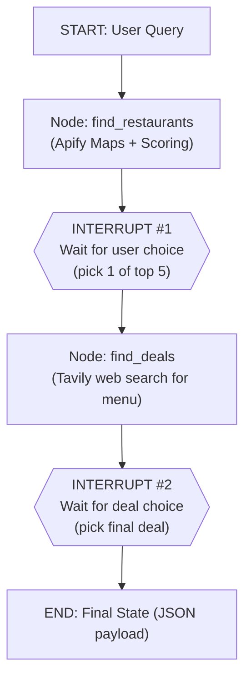

# Food Pilot — Agent 1: Discovery / Scout (Finder + Picker)

> [!info] Objective
> Turn a vague craving ("I'm craving a good burger") into a **concrete selected restaurant** and a **specific menu deal**, then output a **structured JSON payload** for the next agent in the pipeline.

> [!success] This is **Agent 1** of Food Pilot — my task
> The Finder + Picker agent (LangGraph). Its JSON output ("State") feeds [[Architecture|the rest of the system]] (Food / Order agents).

---

## 1. Required Tools

| Tool | What it does |
|---|---|
| **Apify Google Maps Extractor** | pull POI data: name, star rating, review count, exact coordinates |
| **Distance Calculator** | Python Haversine function: user coords → restaurant coords |
| **Web Search API — Tavily** | scour the web for menus, prices, current promo deals |

---

## 2. Execution Workflow

1. **Intent Parsing** — extract the core food entity from the query (e.g. `burger`).
2. **Broad Discovery** — Apify searches the area for restaurants matching the food entity.
3. **Criteria Scoring** — score + rank restaurants with the weighted formula (§4).
4. **HITL #1 — Restaurant Selection** — pause; show **top 5** (name, score, reason); user picks 1.
5. **Targeted Deep Dive** — Tavily search scoped to the chosen restaurant: menu items, prices, deals.
6. **HITL #2 — Deal Selection** — pause; show menu options/deals; user picks 1.
7. **State Compilation** — package decisions into the JSON payload (§5).

---

## 3. LangGraph Architecture (Nodes & Interrupts)



### Node Breakdowns

**`find_restaurants` node**
- **Action:** takes `user_query` → calls Apify → computes proximity + rating → scores → writes top 5 to `found_restaurants`.
- **LangGraph:** compile with `interrupt_before=["ask_user_restaurant"]`.

**User Selection Phase (HITL #1)**
- Graph state **freezes**. Backend reads `found_restaurants`, shows them, waits.
- On user click → update state with `selected_restaurant` → `.resume()` to continue.

**`find_deals` node**
- **Action:** reads `selected_restaurant` → Tavily search like `"Menu prices [Restaurant Name]"` or `"[Restaurant Name] special offers"`.
- **LangGraph:** `interrupt_before=["ask_user_deal"]` to freeze for the deal pick.

---

## 4. Scoring Algorithm

> [!tip] Weighted score, computed in Python before showing the top 5.

| Criteria | Weight | Logic |
|---|---|---|
| **Proximity** | 40% | inversely proportional to distance (1 km ≫ 10 km) |
| **Quality** | 30% | Google Maps star rating (out of 5) |
| **Reliability** | 15% | log scale of review count (stops 1×5-star beating 4.6 with 2000 reviews) |
| **Price Match** | 15% | alignment with user budget ($ query ↔ $ restaurant) |

```python
import math

def score(r, user, max_dist_km=10):
    proximity  = max(0, 1 - haversine(user, r.coords) / max_dist_km)  # 1=near, 0=far
    quality    = r.rating / 5.0
    reliability= min(1.0, math.log10(r.reviews + 1) / 4)              # ~10k reviews -> 1.0
    price_match= 1.0 if r.price_level == user.budget else 0.5
    return (0.40*proximity + 0.30*quality + 0.15*reliability + 0.15*price_match)
```

---

## 5. Output Payload (the "State")

> [!example] Strictly formatted JSON passed to the next agent

```json
{
  "order_status": "configured",
  "user_intent": "burger",
  "selected_restaurant": {
    "name": "Example Burger Joint",
    "address": "123 Main Street",
    "coordinates": { "lat": 31.2001, "lon": 29.9187 },
    "google_maps_rating": 4.7
  },
  "selected_deal": {
    "item_name": "Double Smashburger Combo",
    "price": "250",
    "currency": "EGP",
    "deal_description": "Includes medium fries and a drink.",
    "source_url": "https://example-restaurant-menu-link.com"
  }
}
```

---

## 6. Monitoring with LangSmith

- **Apify cost & latency** — see how long the scraper takes + the raw JSON before scoring filters it.
- **State resumption tracing** — trace pauses at each interrupt and re-links to the same thread ID on `.resume()`.
- **Prompt Playground for scoring/extraction** — pull a failed web response into the Playground to refine the menu-extraction prompt.

---

## 7. Frontend (for now: Backend / CLI)

> [!note] Decision: **backend service / CLI** for now
> - The two HITL selections happen via **API calls** (FastAPI) or **terminal prompts** (CLI).
> - LangGraph freezes at each interrupt; the backend surfaces `found_restaurants` / deals, takes the user's pick, then `.resume()`s.
> - A web UI (Streamlit / Next.js) can be added later without changing the graph.

---

## 8. Implementation Plan (small tasks → steps)

> [!abstract] How we'll build it
> Work through these tasks in order. Each task is small and independently testable. Tick steps as you go. When **all tasks pass**, push to branch **`Finder and picker agent`**.

### Task 0 — Project setup
- [ ] Create `.venv` and `pip install -r requirements.txt`.
- [ ] Copy `.env.example` → `.env`, fill `ANTHROPIC_API_KEY`, `APIFY_API_TOKEN`, `TAVILY_API_KEY`, `LANGSMITH_API_KEY`.
- [ ] Confirm `python -c "import langgraph, apify_client, tavily"` runs with no error.
- [ ] Create folder `agent1_scout/` with empty `__init__.py`.

### Task 1 — Define the State schema
- [ ] In `agent1_scout/state.py`, define a `pydantic`/`TypedDict` `ScoutState` with: `user_query`, `food_entity`, `user_coords`, `budget`, `found_restaurants`, `selected_restaurant`, `found_deals`, `selected_deal`, `payload`.
- [ ] Write the final JSON payload shape (matches §5) as a `pydantic` model `OrderPayload`.
- [ ] **Test:** instantiate the state with dummy values, print it.

### Task 2 — Intent parsing
- [ ] In `agent1_scout/intent.py`, write `parse_intent(user_query) -> food_entity (+ optional budget)` using Claude.
- [ ] **Test:** `"I'm craving a good burger"` → `burger`; `"cheap pizza"` → `pizza`, budget `$`.

### Task 3 — Distance calculator
- [ ] In `agent1_scout/distance.py`, write `haversine(coord_a, coord_b) -> km` (pure Python, no API).
- [ ] **Test:** known city pair returns the expected distance (±1 km).

### Task 4 — Apify discovery tool
- [ ] In `agent1_scout/discovery.py`, write `search_restaurants(food_entity, user_coords, n) -> list[Restaurant]` via Apify Google Maps Extractor (name, rating, reviews, coords, address, price level).
- [ ] **Test:** returns ≥1 restaurant for a real query; log raw payload (visible in LangSmith later).

### Task 5 — Scoring algorithm
- [ ] In `agent1_scout/scoring.py`, implement the §4 formula (40 proximity / 30 quality / 15 reliability / 15 price match) using `haversine`.
- [ ] `rank_top5(restaurants, user) -> top 5 with score + reason`.
- [ ] **Test:** a near 4.6★/2000-review place outranks a far 5.0★/1-review place.

### Task 6 — `find_restaurants` node
- [ ] In `agent1_scout/nodes.py`, write the node: intent → Apify → score → write `found_restaurants` (top 5) to state.
- [ ] **Test:** node runs end-to-end on a query and fills `found_restaurants`.

### Task 7 — Interrupt #1 (pick restaurant)
- [ ] Add `ask_user_restaurant` interrupt; compile graph with `interrupt_before=["ask_user_restaurant"]`.
- [ ] Backend/CLI: show top 5, read choice, update `selected_restaurant`, `.resume()`.
- [ ] **Test:** graph pauses, accepts a CLI pick, resumes.

### Task 8 — Tavily deal deep-dive
- [ ] In `agent1_scout/deals.py`, write `find_deals(selected_restaurant, food_entity) -> list[Deal]` using Tavily queries (`"Menu prices [name]"`, `"[name] special offers"`).
- [ ] Extract item name, price, currency, description, source_url.
- [ ] **Test:** returns ≥1 deal with a source URL for a real restaurant.

### Task 9 — `find_deals` node + Interrupt #2 (pick deal)
- [ ] Add `find_deals` node and `ask_user_deal` interrupt (`interrupt_before=["ask_user_deal"]`).
- [ ] Backend/CLI: show deals, read choice, update `selected_deal`, `.resume()`.
- [ ] **Test:** graph pauses again, accepts a deal pick, resumes.

### Task 10 — State compilation (JSON payload)
- [ ] In `agent1_scout/compile.py`, build the final `OrderPayload` JSON (§5) from state.
- [ ] **Test:** output validates against the `OrderPayload` model and matches the spec exactly.

### Task 11 — Wire the full graph
- [ ] In `agent1_scout/graph.py`, assemble: `find_restaurants → I#1 → find_deals → I#2 → END(payload)`.
- [ ] Add a `main.py` CLI runner that drives the two interrupts via terminal prompts.
- [ ] **Test:** full run from a craving to a valid JSON payload.

### Task 12 — LangSmith tracing
- [ ] Set `LANGSMITH_TRACING=true` + project; confirm runs appear in LangSmith.
- [ ] **Test:** a full run shows the two interrupt pauses + Apify/Tavily tool calls in the trace.

### Task 13 — Finalize & push
- [ ] Add a short `agent1_scout/README.md` (how to run).
- [ ] Run all task tests once more.
- [ ] Commit and push to branch **`Finder and picker agent`** (see §9).

---

## 9. Git — push to the agent branch

> [!note] Only when the agent is done
> Push the agent code to its own branch, not `main`.

```bash
cd "f:/ITI/Agentic/FoodPilot-AI"

# create the branch
git checkout -b "Finder and picker agent"

# stage the agent code + this spec
git add agent1_scout/ "Agent 1 - Discovery (Scout).md"

# commit
git commit -m "Add Agent 1: Finder and Picker (Scout) discovery agent"

# push the new branch
git push -u origin "Finder and picker agent"
```

---

## Related
- [[Architecture]] — Food Pilot overall plan
