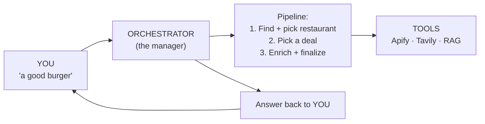
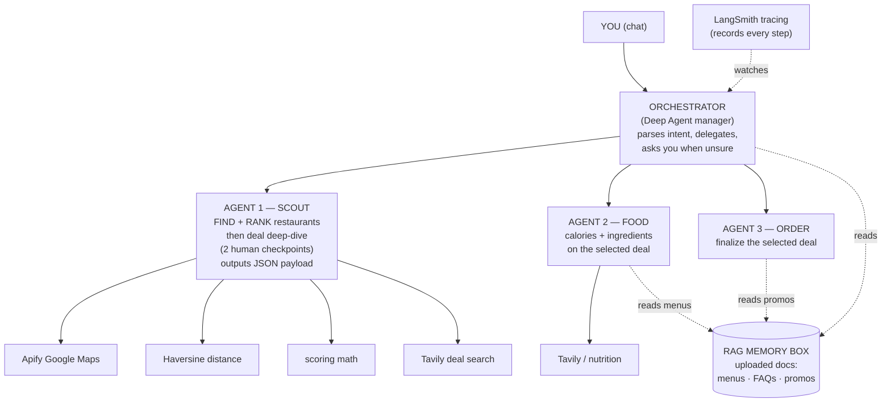
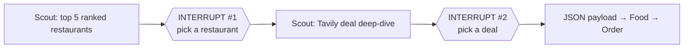
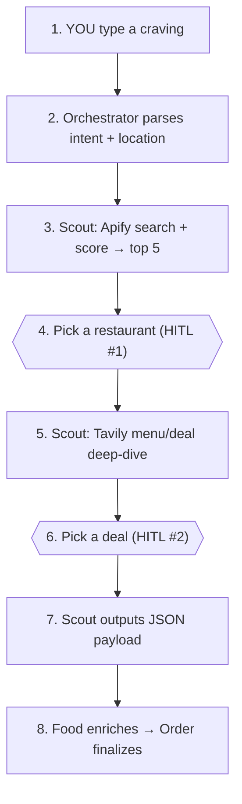

# Food Pilot — Architecture (Overall)

> [!info] What is it?
> **Food Pilot** is a multi-agent chatbot. You tell it what you're craving (e.g. "a good burger" or "~300 cal with rice"), it finds and ranks nearby restaurants, helps you choose a deal, then prepares everything for ordering.

> [!success] Built to meet ALL course requirements
> RAG · Web search · Multi-agent delegation (Deep Agents) · Human-in-the-loop · LangSmith tracing · Podman container. See [[#8 Course Requirements Map]].

---

## 1. The Big Idea

---

## 2. The Full Map (Orchestrator → Agents → Tools)

> [!tip] Read it top to bottom
> **Top** = the manager (delegates work) · **Middle** = the agents · **Bottom** = the tools.
> The **RAG memory box** is shared. **LangSmith** watches everything. It all runs in a **Podman** container.

> [!note] Where each course skill is
> - **RAG** = the memory box (uploaded menu / FAQ / promo docs).
> - **Web search** = Scout (Apify maps + Tavily deals), Food (nutrition).
> - **Multi-agent delegation** = Orchestrator → Scout / Food / Order (Deep Agents).
> - **Human-in-the-loop** = Scout's **two interrupts** (pick restaurant → pick deal).
> - **LangSmith** = traces every agent + tool call.
> - **Podman** = the whole thing runs in one container.

---

## 3. The Three Agents

### Orchestrator (manager / Deep Agent)
- **Job:** parse the craving, delegate to the agents, answer FAQs from RAG.
- **Tools:** delegate-to-agent · ask the user · read **RAG FAQs**.

### Agent 1 — Scout (FIND + RANK + DEAL) *(my task)*
- **Job:** find nearby restaurants, **rank** them, let the user pick one, then **deep-dive its menu/deals** with Tavily and let the user pick a deal. Outputs a strict **JSON payload**.
- **Tools:** Apify Google Maps · Haversine distance · scoring math · Tavily deal search · 2 HITL interrupts.
- **Full spec:** [[Agent 1 - Discovery (Scout)]]

### Agent 2 — Food (enrich)
- **Job:** add **calories / ingredients / cuisine** to the selected deal.
- **Tools:** Tavily / nutrition lookup · read **RAG menus**.

### Agent 3 — Order (finalize)
- **Job:** finalize the selected deal (apply promo, summarize for the user).
- **Tools:** read **RAG promos**.

---

## 4. The Memory Box (RAG — from uploaded docs)

You upload documents; they are embedded and stored so agents can search them.

| Holds | Uploaded content | Read by |
|---|---|---|
| Menus | food + price + ingredients | Food |
| FAQs | delivery area, allergy, refund | Orchestrator |
| Promos | discount codes | Order |

---

## 5. Human-in-the-Loop (two checkpoints, both in Scout)

> [!warning] The pipeline pauses for the user twice
> Scout never auto-picks — it stops and asks at each decision.

---

## 6. Step by Step (the main flow)

---

## 7. Tools List

| Tool | Used by | What it does | Course skill |
|---|---|---|---|
| Apify Google Maps | Scout | find nearby restaurants + ratings + coords | Web search |
| Haversine distance | Scout | user coords → restaurant distance | — |
| Scoring math | Scout | rank by 40/30/15/15 formula | — |
| Tavily deal search | Scout | menu items, prices, promos for chosen place | Web search |
| Nutrition lookup | Food | calories / macros / ingredients | Web search |
| RAG box | all | uploaded menus, FAQs, promos | RAG |
| HITL interrupts | Scout | user picks restaurant, then deal | Human-in-the-loop |

---

## 8. Course Requirements Map

| Requirement | How Food Pilot does it |
|---|---|
| **RAG from uploaded docs** | Memory box: upload menus / FAQs / promos, agents search them |
| **Web search tool** | Scout (Apify + Tavily), Food (nutrition) |
| **Multi-agent delegation (Deep Agents)** | Orchestrator delegates to Scout / Food / Order |
| **Human-in-the-loop** | Scout's two interrupts: pick restaurant → pick deal |
| **LangSmith tracing** | Every agent + tool call is traced |
| **Containerized with Podman** | The whole app ships in one Podman container |

---

## 9. Tech Stack

| Layer | Choice |
|---|---|
| LLM | Claude (Opus / Sonnet) |
| Agents | LangGraph **Deep Agents** (delegation + interrupts) |
| RAG | uploaded docs → embeddings → vector store |
| Web search | **Apify** (restaurants) + **Tavily** (deals/nutrition) |
| Tracing | **LangSmith** |
| Container | **Podman** |
| Frontend | Backend / CLI for now (web UI later) |

---

## Related
- [[Agent 1 - Discovery (Scout)]] — my task: the Finder + Picker agent
