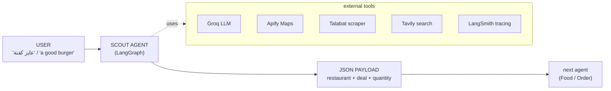
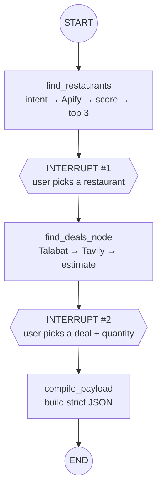
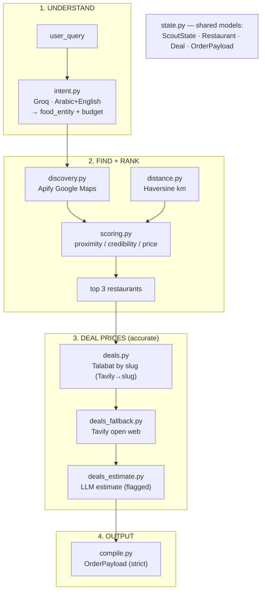
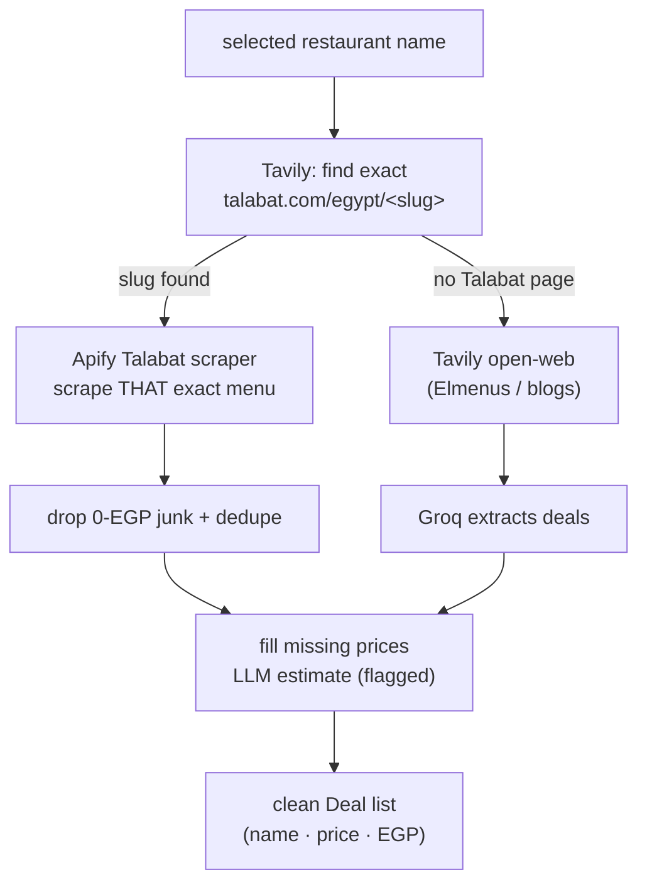
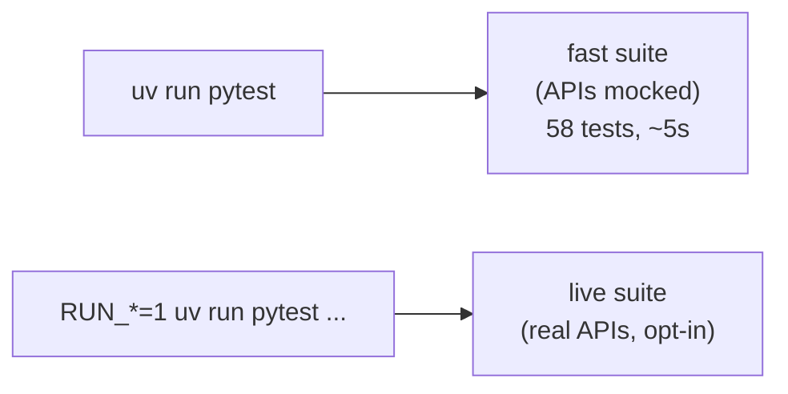

# 🍔 Food Pilot — Agent 1: Discovery / Scout (Finder + Picker)

> The first agent of the Food Pilot pipeline. It turns a vague craving
> (**Egyptian Arabic or English**) into a **selected restaurant** and a
> **selected deal + quantity**, then outputs a strict **JSON payload** for the
> next agent.

---

## 1. What this agent does (big picture)



The user makes **two choices** along the way (which restaurant, which deal) —
these are the two **human-in-the-loop** checkpoints.

---

## 2. The graph (what runs, in order)



| Node | File | Job |
|---|---|---|
| `find_restaurants` | `nodes.py` | parse craving → search Apify → score → **top 3** |
| `ask_user_restaurant` | `nodes.py` | **INTERRUPT #1** — user picks 1 restaurant |
| `find_deals_node` | `nodes.py` | get that restaurant's live menu deals |
| `ask_user_deal` | `nodes.py` | **INTERRUPT #2** — user picks a deal + quantity |
| `compile_payload` | `nodes.py` / `compile.py` | build the JSON output |

The interrupts use LangGraph's `interrupt()` + a checkpointer: the graph
**freezes**, the CLI shows options, and `.invoke(Command(resume=...))` continues.

---

## 3. How each task fits together (modules we built)



---

## 4. Scoring — how restaurants are ranked

Computed in Python before showing the user the top 3.

| Criteria | Weight | Logic |
|---|---|---|
| **Proximity** | 40% | Haversine distance — nearer scores higher |
| **Credibility** | 50% | `(rating/5) × min(1, log10(reviews+1)/4)` — high **only** when rating AND review count are both high |
| **Price match** | 10% | restaurant price tier vs the user's budget |

> Why "credibility" and not raw rating? A 4.9★ place with 3 reviews should **not**
> beat a 4.6★ place with 2,000 reviews. The log term rewards proven places.

---

## 5. Accurate Egyptian menu prices (the important part)



Why the slug step? Talabat's name-search returns a **generic list** and can match
the **wrong restaurant** (e.g. "Primo's Pizza" → a sushi bar). Finding the exact
Talabat URL first and scraping **by slug** pins the right place.

---

## 6. Output payload (handed to the next agent)

```json
{
  "order_status": "configured",
  "user_intent": "burger",
  "selected_restaurant": {
    "name": "...", "address": "...", "phone": "...",
    "coordinates": {"lat": 0, "lon": 0},
    "google_maps_rating": 4.6
  },
  "selected_deal": {
    "item_name": "...", "price": "250", "currency": "EGP",
    "deal_description": "...", "source_url": "...",
    "quantity": 2, "portion": ""
  }
}
```

`quantity` = how many the user ordered. `portion` = size/weight, used later by the
nutrition agent.

---

## 7. Tech stack

| Layer | Choice |
|---|---|
| Orchestration | **LangGraph** (nodes + `interrupt()` for human-in-the-loop) |
| LLM | **Groq** (`langchain-groq`) — intent parsing, deal extraction, price estimate |
| Restaurants | **Apify** Google Maps Extractor |
| Menu prices | **Apify** Talabat scraper (by slug) + **Tavily** web search |
| Tracing | **LangSmith** (project `FoodPilot-AI`) |
| Packaging | **uv** (`pyproject.toml` + `uv.lock`) |

---

## 8. Project layout

```
agent1_scout/
  config.py          env + settings (Groq, Apify, Tavily, LangSmith)
  state.py           ScoutState, Restaurant, Deal, OrderPayload
  intent.py          parse craving (Arabic/English) -> food + budget
  distance.py        Haversine km
  discovery.py       Apify Google Maps -> Restaurant[]
  scoring.py         rank_top3 (proximity / credibility / price)
  deals.py           Talabat-by-slug + find_deals orchestrator
  deals_fallback.py  Tavily open-web fallback
  deals_estimate.py  LLM price estimate (flagged)
  compile.py         build the JSON payload
  nodes.py           the 5 graph nodes + 2 interrupts
  graph.py           assembles + compiles the LangGraph
main.py              CLI runner (drives both interrupts)
scripts/             manual inspection scripts (live API)
tests/               pytest suite (mocked + opt-in live)
```

---

## 9. Run it

```bash
# 1. install deps (uv creates the venv)
uv sync

# 2. set your keys
cp .env.example .env
#   fill: GROQ_API_KEY, APIFY_API_TOKEN, TAVILY_API_KEY, LANGSMITH_API_KEY

# 3. run the CLI agent
uv run python main.py
uv run python main.py --query "I'm craving a good burger" --location "Maadi, Cairo"
uv run python main.py --query "I'm craving a good burger" --location "Maadi, Cairo" --lat 29.96 --lon 31.26
```

When `--lat` and `--lon` are omitted, the CLI resolves `--location` through the
existing Apify Google Maps actor. Passing explicit coordinates avoids that extra
Apify call and is the fallback if a location cannot be resolved.

The CLI prints the **top 3 restaurants** (pick a number), then the **deals**
(pick a number + quantity), then the **final JSON payload**.

---

## 10. How to test (team guide)



### Fast suite (default — no network, safe for everyone)
```bash
uv run pytest          # all external calls are mocked
```
Every task has its own test file:

| Test file | Covers |
|---|---|
| `test_state.py` | data models + payload shape |
| `test_intent.py` | Arabic + English intent (real Groq, auto-skips w/o key) |
| `test_distance.py` | Haversine correctness |
| `test_discovery.py` | Apify result mapping |
| `test_scoring.py` | ranking formula (near+reviewed beats far+new) |
| `test_nodes.py` | find_restaurants node (Arabic) |
| `test_interrupt_restaurant.py` | INTERRUPT #1 pause/resume |
| `test_deals_talabat.py` | slug extraction + junk-price filter |
| `test_deals_fallback.py` | Tavily fallback extraction |
| `test_deals_estimate.py` | flagged price estimate |
| `test_find_deals.py` | Talabat→Tavily→estimate orchestration |
| `test_interrupt_deal.py` | INTERRUPT #2 pick deal + quantity |
| `test_compile.py` | JSON payload matches spec |
| `test_graph.py` | **full graph end-to-end** (mocked) |
| `test_tracing.py` | LangSmith config |

### Live suite (opt-in — hits real APIs, costs credits)
```bash
$env:RUN_APIFY="1"; uv run pytest tests/test_discovery.py # real Apify Maps
RUN_TALABAT=1 uv run pytest tests/test_deals_talabat.py    # real Tavily+Talabat
RUN_TAVILY=1  uv run pytest tests/test_deals_fallback.py   # real Tavily+Groq
RUN_DEALS=1   uv run pytest tests/test_find_deals.py       # full deal pipeline
RUN_LIVE=1    uv run pytest tests/test_nodes.py            # real Groq+Apify
RUN_TRACE=1   uv run pytest tests/test_tracing.py          # verify LangSmith trace
```

### Manual inspection (run a real query, save results to JSON)
```bash
uv run python -m scripts.inspect_discovery "burger" "Maadi, Cairo" 5
uv run python -m scripts.inspect_deals "Primo's Pizza" "pizza" eg
```

> **Current status:** `58 passed, 7 skipped` (skips = the opt-in live tests above).
