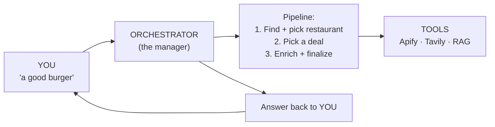
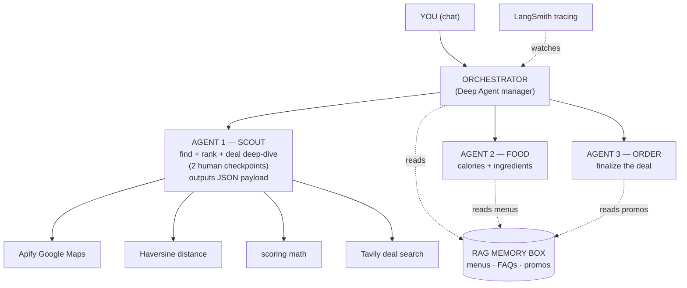
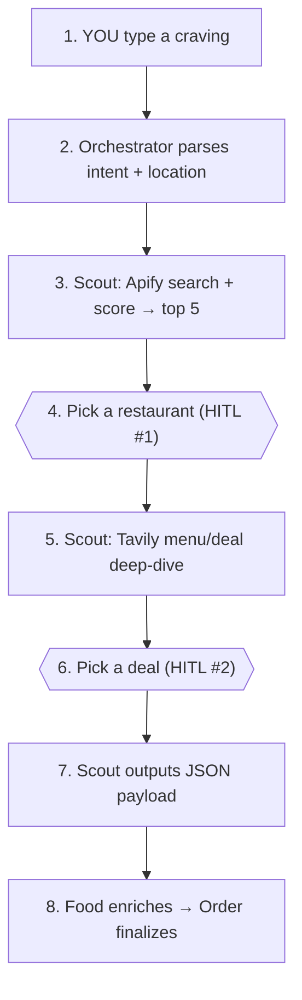

# 🍔 Food Pilot

**Food Pilot** is a multi-agent chatbot. You tell it what you're craving (e.g. *"a good burger"* or *"~300 cal with rice"*), and it finds and ranks nearby restaurants, helps you choose a deal, then prepares everything for ordering.

Built to demonstrate a full agentic stack: **RAG · Web search · Multi-agent delegation (Deep Agents) · Human-in-the-loop · LangSmith tracing · Podman**.

---

## ✨ Overview

A **Deep Agent orchestrator** parses the craving and delegates to three agents. The shared **RAG memory box** holds uploaded menus/FAQs/promos, **LangSmith** traces every step, and the whole app runs in a **Podman** container.

---

## 🤖 The Agents

| Agent | Job | Key tools |
|---|---|---|
| **Orchestrator** | Parse intent, delegate, answer FAQs from RAG | delegate · ask user · RAG FAQs |
| **Agent 1 — Scout** | Find + rank restaurants, deal deep-dive (2 human checkpoints), output JSON payload | Apify Maps · Haversine · scoring · Tavily |
| **Agent 2 — Food** | Add calories / ingredients / cuisine to the selected deal | Tavily / nutrition · RAG menus |
| **Agent 3 — Order** | Finalize the selected deal (promo, summary) | RAG promos |

---

## 🔄 Flow (with Human-in-the-Loop)

The pipeline **pauses for the user twice** inside Scout — it never auto-picks.

---

## 🧮 Scout Scoring Formula

Restaurants are ranked by a weighted score before the top 5 are shown:

| Criteria | Weight | Logic |
|---|---|---|
| **Proximity** | 40% | inversely proportional to distance (1 km ≫ 10 km) |
| **Quality** | 30% | Google Maps star rating (out of 5) |
| **Reliability** | 15% | log scale of review count |
| **Price Match** | 15% | alignment with user budget |

---

## 🧠 RAG Memory Box

Upload documents; they are embedded and stored so agents can search them.

| Holds | Content | Read by |
|---|---|---|
| Menus | food + price + ingredients | Food |
| FAQs | delivery area, allergy, refund | Orchestrator |
| Promos | discount codes | Order |

---

## 🛠️ Tech Stack

| Layer | Choice |
|---|---|
| LLM | Claude (Opus / Sonnet) |
| Agents | LangGraph **Deep Agents** (delegation + interrupts) |
| RAG | uploaded docs → embeddings → vector store |
| Web search | **Apify** (restaurants) + **Tavily** (deals / nutrition) |
| Tracing | **LangSmith** |
| Container | **Podman** |
| Frontend | Backend / CLI for now (web UI later) |

---

## ✅ Course Requirements

| Requirement | How Food Pilot does it |
|---|---|
| RAG from uploaded docs | Memory box of menus / FAQs / promos |
| Web search tool | Scout (Apify + Tavily), Food (nutrition) |
| Multi-agent delegation (Deep Agents) | Orchestrator → Scout / Food / Order |
| Human-in-the-loop | Scout's two interrupts: pick restaurant → pick deal |
| LangSmith tracing | Every agent + tool call traced |
| Containerized with Podman | Whole app ships in one container |

---

## 📄 Docs

- [`Architecture.md`](Architecture.md) — full overall architecture and diagrams.

> Agent 1 (Discovery / Scout) is under active development.
